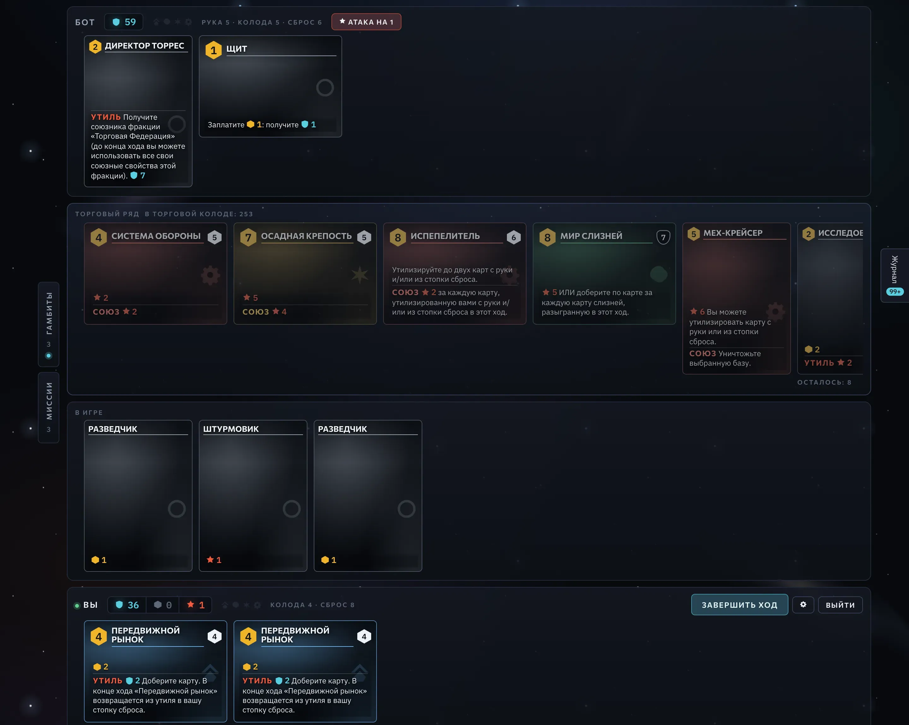
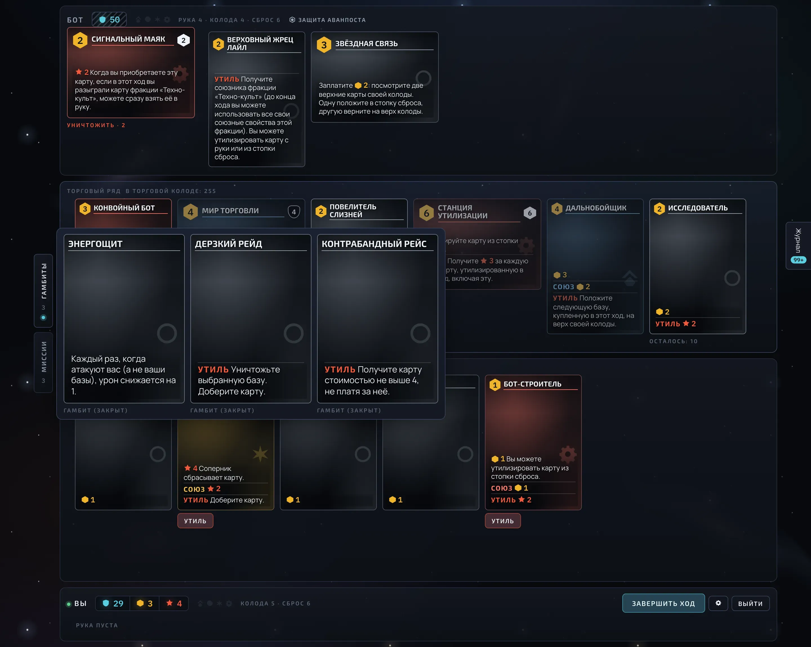
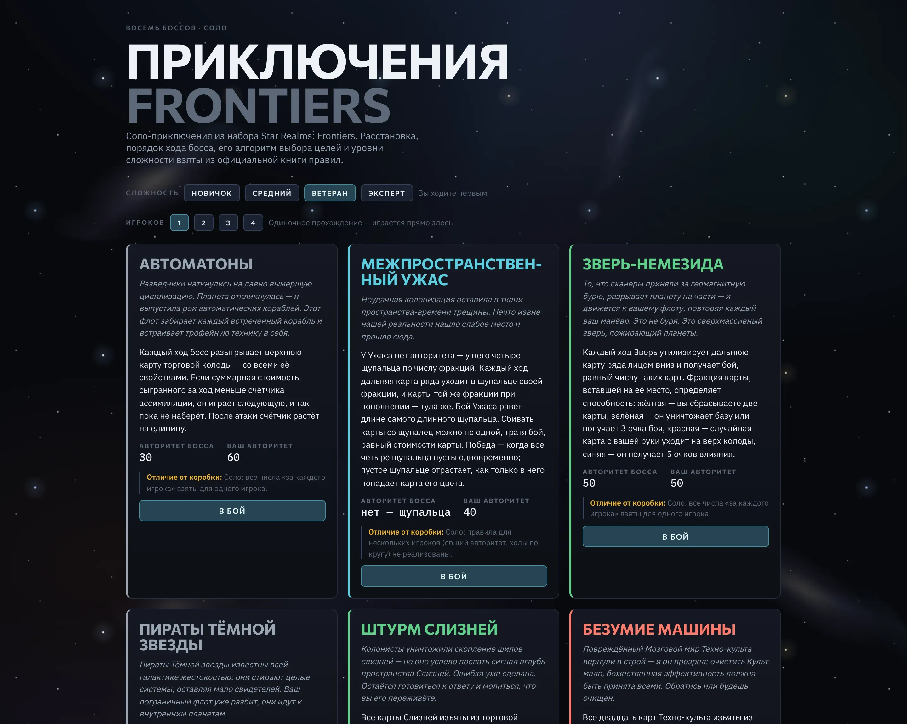
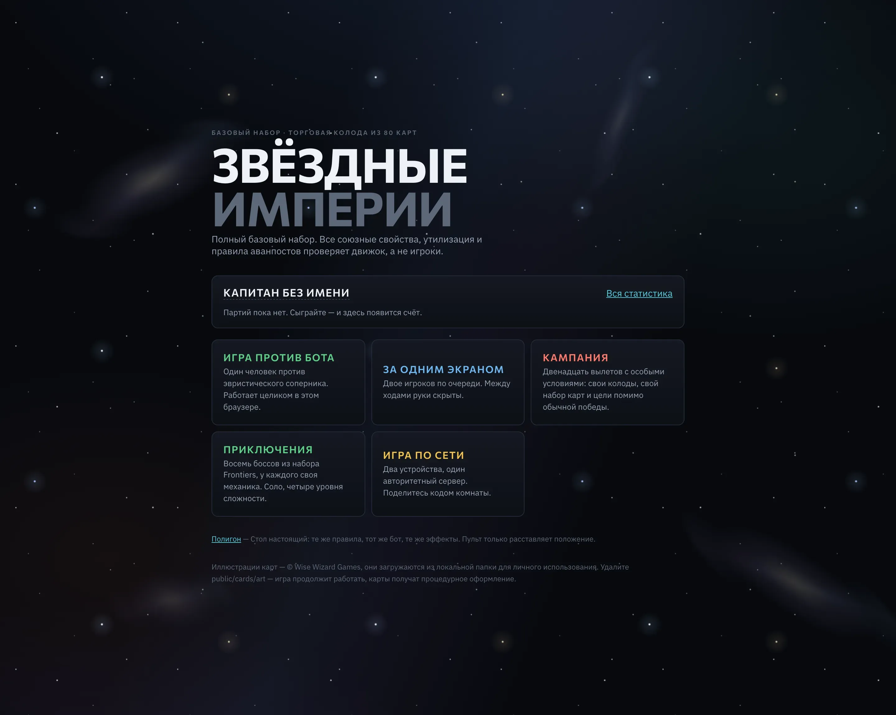

<div align="center">



<p>
  
  
  
  
  
</p>

**«Звёздные империи» целиком в браузере: колода собирается прямо в бою — покупаешь корабли
из торгового ряда, связываешь их союзами фракций и сбиваешь авторитет соперника с 50 до нуля.**

<sub>Один движок на все режимы · сервер — источник истины · интерфейс и карты на русском</sub>

</div>

---

## О проекте

Дека-билдер, где стартовая колода из десяти слабых карт превращается в машину за десяток
ходов. Общий торговый ряд из пяти карт — единственный магазин, и он один на двоих: карта,
которую вы не купили, достаётся сопернику.

Правила живут в отдельном пакете, свободном от React, DOM и сети. Один и тот же движок
считает партию во всех режимах: игра против бота и за одним экраном крутят его прямо в
браузере, онлайн — на сервере. Интерфейс не знает, где именно он выполняется, потому что
во всех трёх случаях получает один и тот же **отредактированный снимок**: без колод, без
чужой руки, без состояния генератора случайных чисел.

## Что внутри

| | |
|---|---|
| ♟️ **Полные правила** | Розыгрыш, покупка, союзы, утиль, аванпосты, бой по базам и авторитету |
| 🃏 **390 карт** | 23 набора: базовый, Frontiers, Colony Wars, Crisis, United, High Alert, промо |
| 🤖 **Бот** | Эвристический соперник трёх уровней, видит только свой отредактированный вид |
| 🌍 **Игра по сети** | Комната по пятизначному коду, состояние на сервере, возврат по токену места |
| 🛡️ **12 миссий кампании** | Три кампании со своими колодами, стартовыми базами и целями помимо победы |
| 👾 **8 боссов** | Приключения из Frontiers: сценарные и колодные, четыре уровня сложности |
| 🎯 **Гамбиты и миссии** | Раздаются до партии: разовые козыри и альтернативное условие победы |
| 🚀 **Командные колоды** | Семь легендарных командиров: своя стартовая колода, размер руки и авторитет |
| 🏟️ **20 арен** | Сценарии, меняющие одно правило на всю партию |
| 📊 **Профиль** | Победы, серии, длительность партий, любимые фракции и карты — по каждому режиму отдельно |
| ✨ **Эффекты стола** | Полёт ресурсов «сколько единиц — столько значков», взрывы баз, растворение утиля |
| 🔊 **Звук без файлов** | Весь стол озвучен Web Audio API прямо в браузере |
| ⚙️ **Настройки** | Размер карт и текста, громкость, вспышки, темп хода бота — всё применяется на лету |
| 🧪 **Полигон** | Пульт, который расставляет любую ситуацию на настоящем столе: `/lab` |

## Как это выглядит

Снимки сделаны **без издательских иллюстраций** — так игра выглядит у того, кто не запускал
`npm run fetch-cards`: карта получает процедурное оформление по своей фракции. Рисунки
принадлежат Wise Wizard Games и в репозиторий не попадают.

<table>
  <tr>
    <td width="50%"><br><sub><b>Стол</b> — торговый ряд, своя зона, счётчики торговли, боя и авторитета</sub></td>
    <td width="50%"><br><sub><b>Вкладки слева</b> — гамбиты, миссии и технологии не занимают место у баз</sub></td>
  </tr>
  <tr>
    <td><br><sub><b>Приключения</b> — восемь боссов Frontiers, четыре уровня сложности</sub></td>
    <td><br><sub><b>Главная</b> — режимы и счёт игрока</sub></td>
  </tr>
</table>

## Как это устроено

```
packages/engine/     правила. чистые: ни react, ни dom, ни node, ни сокетов
packages/protocol/   схемы провода (zod) + ENGINE_VERSION
apps/web/            интерфейс, свой сервер, реестр партий, бот
```

### Четыре функции держат всю конструкцию

```ts
reduce(state, cmd)                  // применить одну команду
settle(state)                       // доиграть до следующего требуемого ввода
enumerateLegalActions(view, seat)   // определена над ВИДОМ, а не над состоянием
redact(state, seat)                 // проекция в отдельный тип PlayerView
```

`PlayerView` собирается поле за полем, а не копируется с вычёркиванием: в нём нет ни `rng`,
ни массива колоды, поэтому секрет, добавленный в `GameState` завтра, не сможет случайно
уехать клиенту. Байты для клиента производят ровно две функции — `redact` и `redactEvent`.

`enumerateLegalActions` принимает вид, и сервер вызывает её как
`enumerateLegalActions(redact(state, seat), seat)`. Это делает структурно невозможным
законный ход, зависящий от скрытой информации, — ровно как за физическим столом. Тот же
генератор питает интерфейс, проверку на сервере, бота и фаззинг-тесты.

### Чистота движка не подразумевается, а проверяется

ESLint запрещает внутри `packages/engine` `Date`, `Math.random`, `crypto`, `fetch`,
`console`, DOM и любой импорт наружу, а dependency-cruiser утверждает это свойство в CI.
Один нечистый вызов — и режимы начнут молча расходиться, а повторы перестанут
воспроизводиться.

## Быстрый старт

Нужны Node.js 20+ и npm.

```bash
npm install
npm run fetch-cards     # по желанию — качает иллюстрации в локальную папку, она в .gitignore
npm run dev             # http://localhost:3000
```

`npm run dev` поднимает свой Node-сервер: Next.js и Socket.IO живут на одном порту.

## Команды

```bash
npm test           # движок: фаззинг целых партий, свойства утечек, соответствие правилам
npm run lint       # включая правила чистоты движка
npm run depcruise  # утверждает, что движок не импортирует ничего наружу
npm run build      # next build + сборка сервера через esbuild
npm run report     # прогоняет настоящий браузер по всем режимам, пишет reports/index.html
npm run card-sheet # лист всех форматов и типов карт, reports/card-sheet.html
npm run shots      # снимки интерфейса для README, docs/screenshots/ (иллюстрации при съёмке заблокированы)
```

## Язык

Интерфейс, тексты карт и журнал партии — на русском. Терминология взята из официальных
правил русского издания «Звёздные империи» (Hobby World): очки торговли / боя / влияния,
торговый ряд, торговая колода, личная колода, стопка сброса, утиль, аванпост, первичное /
союзное / утилизационное свойство, разведчик, штурмовик, исследователь.

Названия карт — наш перевод, кроме подтверждённых правилами («Техномир», «Разведчик»,
«Штурмовик», «Исследователь»): публичного списка названий русского издания найти не
удалось, поэтому они могут расходиться с коробочными. На механику это не влияет — движок
оперирует идентификаторами, а не текстом.

Локализация живёт в `apps/web/src/i18n/`. Движок свободен от языка: он присылает вид
запроса и границы выбора (`prompt`, `min`, `max`), а формулировку целиком строит
интерфейс, поэтому второй язык не затронет правила.

Шрифты — Commissioner на названиях карт, кнопках и метках зон и IBM Plex Sans в описаниях
свойств.
Оба берутся с кириллическими подмножествами, и это первое требование к кандидату: у
IBM Plex Sans Condensed, например, в Google Fonts есть только `cyrillic-ext`, без базовой
кириллицы, и названия карт молча падали бы на системный шрифт.

## Настройки отображения

Шестерёнка на столе открывает панель: размер карт и отдельно размер текста на них,
громкость, вспышки и темп хода бота. Значения сохраняются в `localStorage` этого браузера.

Хранятся **множители**, а не абсолютные пиксели. Ширина карты собирается как
`calc(var(--card-w-base) * var(--card-scale))`: база остаётся адаптивной (медиазапросы
уменьшают её на узких экранах), а выбор игрока накладывается поверх. Абсолютное значение,
выставленное на десктопе, приехало бы на телефон как есть.

Сохранённый масштаб применяется инлайн-скриптом в `layout.tsx` до первой отрисовки — иначе
карты успевают появиться в размере по умолчанию и на глазах перескакивают. Из-за этого на
`<html>` стоит `suppressHydrationWarning`.

Всё внутри карты задано в `cqi`, поэтому масштабируется целиком, а уровни плотности
(проза → иконочная сводка → миниатюра) остаются привязанными к фактической ширине: увеличив
карты на телефоне, игрок автоматически получает полный текст.

Темп хода бота — единственная настройка, которая меняет не вид, а ожидание: она ускоряет
чужой ход целиком, вместе с паузой «бот думает» и всеми его вспышками. Свой ход идёт как
обычно — им игрок распоряжается сам.

## Данные карт

Состав торговой колоды сверен карта за картой с издательской таблицей Card Gallery:
46 различных карт базового набора, 80 копий, ровно по 20 на фракцию. Четыре места, где
популярные фанатские источники расходятся с издателем, исправлены в
`packages/engine/src/cards/registry.ts` — см. комментарий в начале файла.

## Лицензия на иллюстрации

Иллюстрации, названия карт и оформление Star Realms — © Wise Wizard Games, лицензии на
фан-контент не существует. `npm run fetch-cards` складывает изображения в
`apps/web/public/cards/art/`, и эта папка в `.gitignore`: они для локального личного
использования и не должны попадать в коммиты, публичные развёртывания или сборки.

Без них игра полностью работоспособна. Отсутствующая картинка — это просто отсутствующий
ключ в сгенерированном манифесте, и карта получает процедурное оформление по своей фракции.
Характеристики карт и механика — факты, а не охраняемая форма выражения, поэтому движок и
его данные ничем не обременены.
